# Hello Tiny (OCaml)

Welcome to **Hello Tiny** — a miniature OCaml program that demonstrates **why types are powerful** and how **functions map between them**.  
This project is for absolute beginners who want to understand functional programming in OCaml and say: *“Wow, types make things so clear!”* 🌈

---

## ✨ Idea

- Ask the user for **one letter**.
- If it’s a letter → show lowercase & uppercase.
- If it’s invalid (digit, symbol, or more than one char) → show a clear error.
- If the user presses Enter with nothing typed → quit politely.

---

## 🎨 Why Types First?

In OCaml, we don’t start with “what the program does.” 
We start with **what kinds of data exist**.

Types are like a **map of possibilities**.  
They make sure we **never forget a case** and the compiler helps us stay safe.

---

## 🧩 Step 1: Our Types

```ocaml
type bad_reason =
    | Not_single_char
    | Not_a_letter

type classified_input =
    | Quit
    | One_letter of char
    | Bad of bad_reason

type outcome =
    | Bye
    | Letter_pair of char * char
    | Error_msg of string
```

**Diagram 1: Types Overview**


Here we see three worlds:

- `classified_input` (raw user input classified)
- `bad_reason` (why something failed)
- `outcome` (what the program finally says/does)

---

## 🧩 Step 2: The Mapping Function

The core logic is one pure function:

```ocaml
let decide (ci : classified_input) : outcome =
    match ci with
    | Quit -> Bye
    | One_letter c -> Letter_pair (to_lower c, to_upper c)
    | Bad Not_single_char ->
            Error_msg "Please enter EXACTLY ONE character."
    | Bad Not_a_letter ->
            Error_msg "Please enter a letter (not a number/symbol)."
```

**Diagram 2: From Classified Input → Outcome**

```mermaid
flowchart LR
        style Q fill:#d0ebff,stroke:#1c7ed6,stroke-width:2px
        style OL fill:#d3f9d8,stroke:#37b24d,stroke-width:2px
        style BN fill:#ffe066,stroke:#f08c00,stroke-width:2px
        style BL fill:#ffe066,stroke:#f08c00,stroke-width:2px

        style Bye fill:#fff9db,stroke:#fab005,stroke-width:2px
        style Pair fill:#e6fcf5,stroke:#20c997,stroke-width:2px
        style Err1 fill:#ffe3e3,stroke:#fa5252,stroke-width:2px
        style Err2 fill:#ffe3e3,stroke:#fa5252,stroke-width:2px

        subgraph Input["🔍 classified_input"]
            Q["Quit"]
            OL["One_letter(c)"]
            BN["Bad Not_single_char"]
            BL["Bad Not_a_letter"]
        end

        subgraph Output["🎯 outcome"]
            Bye["Bye"]
            Pair["Letter_pair(lower, upper)"]
            Err1["Error_msg: multi-char"]
            Err2["Error_msg: not a letter"]
        end

        Q --> Bye
        OL --> Pair
        BN --> Err1
        BL --> Err2
```



This diagram shows every case covered.  
👉 You can literally see why the compiler will never let us forget a branch.

---

## 🧩 Step 3: IO Layer (The Loop)

Finally, a thin recursive loop does the talking:

```ocaml
let rec loop () =
    print_endline "Enter a letter (or press Enter to quit):";
    let line = read_line () in
    let result = decide (classify line) in
    match result with
    | Bye -> print_endline "Goodbye!"
    | Letter_pair (lo, up) ->
            Printf.printf "Lower: %c, Upper: %c\n\n" lo up;
            loop ()
    | Error_msg msg ->
            Printf.printf "[Error] %s\n\n" msg;
            loop ()
```

**Diagram 3: Full Program Flow**

```mermaid
flowchart TD
        style raw fill:#f8f9fa,stroke:#adb5bd,stroke-width:1px
        style classify fill:#d0ebff,stroke:#1c7ed6,stroke-width:2px
        style decide fill:#ffe066,stroke:#f08c00,stroke-width:2px
        style loop fill:#e6fcf5,stroke:#20c997,stroke-width:2px

        raw["⌨️ User types input"] --> classify["classify: string → classified_input"]
        classify --> decide["decide: classified_input → outcome"]
        decide --> loop["loop: outcome → IO actions"]
        loop --> raw
```



---

## ▶️ Run It

**Compile:**
```sh
ocamlc -o hello_tiny hello_tiny.ml
```

**Run:**
```sh
./hello_tiny
```

**Example:**
```
Enter a letter (or press Enter to quit):
a
Lower: a, Upper: A

Enter a letter (or press Enter to quit):
7
[Error] Please enter a letter (not a number/symbol).

Enter a letter (or press Enter to quit):

Goodbye!
```

---

## 🌟 Takeaway

- Types first → define the possible worlds.
- Pattern match → handle each world explicitly.
- Compiler is your buddy → it ensures you don’t miss a case.
- Logic is pure, IO is thin → easy to test, easy to extend.

That’s the OCaml magic: with types and pattern matching, your program becomes a map of possibilities that cannot go wrong silently. 🚀

---